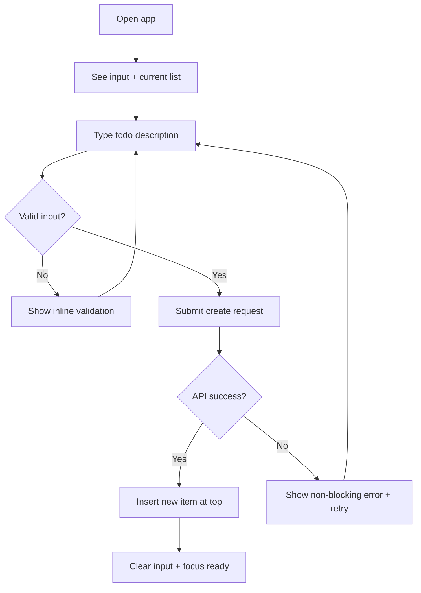
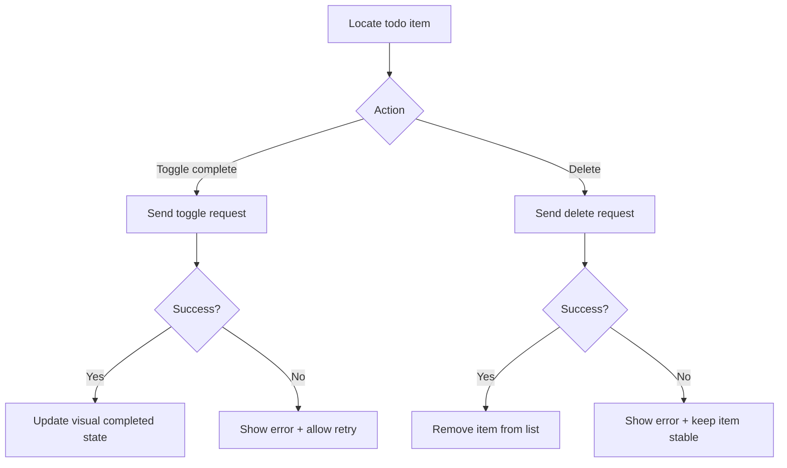
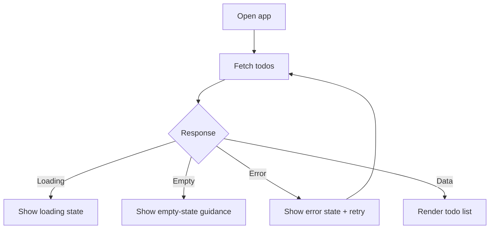

# UX Design Specification aine-todo-app-v3

**Author:** Italosantos
**Date:** 2026-04-29

---

<!-- UX design content will be appended sequentially through collaborative workflow steps -->

## Executive Summary

### Project Vision

Aine Todo App delivers a fast, dependable personal task workflow where users can capture, organize, and maintain todos with minimal friction. The UX vision for V1 is clarity and trust: every action should feel immediate, understandable, and persistent.

### Target Users

The primary users are individuals managing personal tasks with general consumer-level web familiarity. They are likely to use both mobile and desktop, and need a straightforward experience without advanced productivity complexity.

### Key Design Challenges

- Keeping the core CRUD loop effortless while preserving strong feedback and error clarity.
- Designing responsive, accessible interactions that remain usable from 360px mobile screens to desktop widths.
- Ensuring state transitions (loading, empty, error, list) are explicit and never ambiguous.

### Design Opportunities

- Differentiate through a frictionless capture-and-update loop with immediate visual confirmation.
- Build trust with consistent micro-feedback and resilient recovery paths (especially retry and non-blocking errors).
- Create a lightweight but polished interaction model where speed, accessibility, and predictability feel intentionally designed.

## Core User Experience

### Defining Experience

The core experience centers on a fast personal task loop: capture a todo, see it instantly in context, and keep the list current through quick complete/delete actions. The most critical interaction to get right is rapid todo creation followed by immediate visual confirmation in the list. If this interaction is effortless, the rest of the product experience remains coherent and valuable.

### Platform Strategy

V1 is web-first and should be optimized for both touch and mouse/keyboard usage, reflecting mixed mobile and desktop behavior. Interaction models should avoid platform-specific complexity and prioritize consistency across viewport sizes from 360px to 1440px. Offline behavior is treated as out of scope for V1, allowing focus on a reliable online-first flow.

### Effortless Interactions

- Creating a todo should require minimal cognitive load and minimal steps.
- Toggling completion and deleting items should be immediate and clearly reversible in user understanding (through clear feedback).
- State transitions (loading, empty, error, success) should never force users to guess what happened.
- Error recovery should be simple and non-blocking, especially through retry and clear messaging.

### Critical Success Moments

- First successful todo creation and appearance in the list is the initial trust-building moment.
- Smooth complete/delete interactions without confusion determine ongoing product confidence.
- Error scenarios handled with clarity and recoverability prevent abandonment and reinforce reliability.
- A successful first session is when users can add, complete, and remove tasks quickly without guidance.

### Experience Principles

- Prioritize speed to clarity: actions should feel fast and always understandable.
- Minimize friction in the core task loop before adding advanced functionality.
- Preserve trust through consistent feedback and predictable state behavior.
- Design for accessibility and responsiveness as default behavior, not as post-hoc additions.

## Desired Emotional Response

### Primary Emotional Goals

The primary emotional goal is to make users feel calm, in control, and productively focused while managing tasks. The app should reduce mental clutter and create a sense of steady forward momentum.

### Emotional Journey Mapping

- First use: users should feel immediate clarity and low intimidation.
- Core task flow: users should feel speed, confidence, and control.
- After completing actions: users should feel accomplishment and relief.
- Error states: users should still feel trust through clear guidance and easy recovery.
- Return usage: users should feel consistency and reliability, not relearning.

### Micro-Emotions

- Confidence over confusion through explicit states and labels.
- Trust over skepticism through predictable outcomes and persistence.
- Accomplishment over frustration through visible progress and quick interactions.
- Calm over anxiety through minimal friction and non-blocking error handling.

### Design Implications

- Use clear hierarchy and concise language to reinforce calm and control.
- Provide immediate, visible feedback for create/toggle/delete actions.
- Keep interaction patterns consistent across mobile and desktop contexts.
- Treat errors as recoverable moments with clear retry and status messaging.
- Avoid visual noise and unnecessary steps that increase cognitive load.

### Emotional Design Principles

- Clarity first: users should always understand current state and next action.
- Confidence by consistency: repeated actions should behave the same way every time.
- Progress visibility: every meaningful action should produce obvious results.
- Recovery without penalty: failures should be understandable and easy to resolve.

## UX Pattern Analysis & Inspiration

### Inspiring Products Analysis

In the absence of explicitly named inspiration apps, this baseline analysis uses common best-in-class task and productivity products as reference archetypes (simple todo tools, lightweight note capture tools, and clean checklist interfaces). Across these products, success comes from reducing the time between intent and completion, keeping visual hierarchy minimal, and ensuring state changes are immediately understandable.

### Transferable UX Patterns

- Fast capture-first input positioned prominently above the list to minimize friction.
- Immediate insertion of new items with clear visual confirmation.
- Inline, low-effort completion and deletion controls with strong affordance.
- Explicit empty/loading/error states that explain what is happening and what to do next.
- Stable, predictable list behavior that preserves user mental model.

### Anti-Patterns to Avoid

- Overloaded interfaces with excessive controls competing with the core task loop.
- Hidden actions that require discovery effort for common operations.
- Ambiguous feedback after mutations (did it save, fail, or lag?).
- Blocking error patterns that trap users instead of offering clear recovery.
- Inconsistent interaction behavior between mobile and desktop experiences.

### Design Inspiration Strategy

**What to adopt:**
- Capture-first layout, immediate feedback, and explicit state communication as baseline patterns.

**What to adapt:**
- Advanced productivity features should be simplified to match MVP scope and general-user skill level.
- Visual density should be tuned for clarity and accessibility across 360px to 1440px.

**What to avoid:**
- Feature-heavy interaction patterns and hidden complexity that undermine calm, focused task management.

## Design System Foundation

### 1.1 Design System Choice

A themeable design system is selected as the baseline approach for V1, using utility-first styling with reusable component primitives.

### Rationale for Selection

- Balances delivery speed with enough flexibility to create a distinct, calm product feel.
- Supports responsive and accessibility requirements without full bespoke component investment.
- Fits MVP constraints and likely team capacity while preserving a clear path for future evolution.

### Implementation Approach

- Establish reusable UI primitives for form controls, list items, action buttons, state panels, and notifications.
- Standardize spacing, typography scale, color roles, interaction states, and focus behavior through shared tokens/utilities.
- Use composition-first patterns to keep components predictable and maintainable across mobile and desktop contexts.

### Customization Strategy

- Define a lightweight token set for color, radius, spacing, and type roles aligned to emotional goals (calm, clarity, trust).
- Apply consistent interaction patterns for create/toggle/delete and status feedback across all viewports.
- Reserve bespoke styling for brand-defining surfaces while keeping core controls standardized.

## 2. Core User Experience

### 2.1 Defining Experience

The defining experience is: capture a task and see it become actionable instantly. The user should move from intent to recorded task in one uninterrupted flow, with immediate on-screen confirmation.

### 2.2 User Mental Model

Users approach this as a checklist workflow: quickly add tasks, scan current priorities, mark completion, and remove irrelevant items. They expect direct manipulation with minimal ceremony and clear cause-and-effect after every action.

### 2.3 Success Criteria

- Users can add a task in a single short interaction without navigation overhead.
- New tasks appear immediately in the list with clear placement and status.
- Completion/deletion actions provide instant visual confirmation.
- Users always understand whether an action succeeded, is pending, or failed.

### 2.4 Novel UX Patterns

The experience primarily relies on established patterns users already understand (input + list + item actions), with innovation focused on reducing friction and sharpening feedback quality rather than introducing new interaction metaphors.

### 2.5 Experience Mechanics

1. Initiation: user sees a prominent capture field and starts typing immediately.
2. Interaction: user submits task text; task is validated and posted.
3. Feedback: system shows immediate visual state transition and list update.
4. Completion: task becomes part of the active list; user can instantly toggle or delete.
5. Recovery: on failure, user receives clear non-blocking guidance and retry path.

## Visual Design Foundation

### Color System

No existing brand palette was provided, so the baseline color system emphasizes calm clarity and operational trust:
- Primary: deep slate-blue for focus actions and anchors
- Neutral scale: cool grays for structure and legibility
- Success: muted green for completion states
- Warning/Error: amber/red with restrained saturation for clear but non-alarming feedback
- Background layers: soft off-white and subtle elevation contrast for clean hierarchy

Semantic mapping is standardized across components (`primary`, `secondary`, `surface`, `muted`, `success`, `warning`, `error`) to keep behavior consistent.

### Typography System

A readable modern sans-serif stack is used to support fast scanning and low cognitive load. Hierarchy is explicit:
- Headings: strong but compact, prioritizing clarity over flourish
- Body text: highly legible default size and line-height for mixed mobile/desktop usage
- Microcopy/state labels: concise, high-contrast, and unambiguous

Type rhythm prioritizes task readability and state comprehension over stylistic variance.

### Spacing & Layout Foundation

An 8px base spacing system is adopted for predictable composition and component rhythm.
- Compact spacing inside task rows for efficiency
- Generous separation between major sections (input, states, list)
- Responsive layout behavior with stable vertical flow from 360px mobile to desktop widths

Layout emphasizes single-column task focus with controlled max-width for readability on larger screens.

### Accessibility Considerations

- Contrast targets: text and interactive controls meet WCAG AA minimums.
- Focus visibility: clear keyboard focus states on all actionable elements.
- Touch targets: control sizing supports reliable mobile interaction.
- State communication: loading/empty/error/success states use both text and visual cues.
- Motion restraint: avoid excessive animation that could reduce clarity.

## Design Direction Decision

### Design Directions Explored

Eight visual directions were explored through the HTML showcase, varying color emphasis, density, and control styling while preserving the same core task loop.

### Chosen Direction

Direction 1 - Structured Calm is selected as the baseline direction for V1.

### Design Rationale

- Best alignment with calm, clear, trustworthy emotional goals.
- Supports fast scanability and low cognitive overhead.
- Preserves strong action visibility without visual noise.

### Implementation Approach

- Use Direction 1 as the default design language for core screens.
- Borrow selective accents from other directions only when they improve clarity.
- Keep interaction and state feedback patterns consistent with the chosen direction.
EOF
## User Journey Flows

### Journey 1: Create a Todo

Users enter a task, submit, and receive immediate confirmation in-list.

### Journey 2: Complete/Delete a Todo

Users manage existing tasks with immediate feedback and predictable persistence.

### Journey 3: Initial Load and System States

Users should always understand loading, empty, error, or ready status.

### Journey Patterns

- Single-surface task management (capture + list on same screen).
- Immediate mutation feedback with non-blocking recovery on failure.
- Explicit state branches (loading/empty/error/ready) across sessions.

### Flow Optimization Principles

- Minimize time from intent to visible result.
- Keep decision points lightweight and contextual.
- Preserve user trust through stable list behavior and clear recovery actions.
EOF
## Component Strategy

### Design System Components

Use themeable design-system primitives for foundation: text input, buttons, checkbox/switch controls, cards/surfaces, badges, alerts, and layout containers. These cover most structural needs with consistent tokens and accessibility defaults.

### Custom Components

### TodoComposer

**Purpose:** primary capture surface for creating tasks quickly.
**Usage:** always visible at top of main task surface.
**Anatomy:** input, submit action, validation helper text.
**States:** idle, typing, submitting, validation-error, request-error, success-reset.
**Accessibility:** labeled input, keyboard submit, clear error association.

### TodoItemRow

**Purpose:** represent a single task and its inline actions.
**Usage:** repeated in list for active/completed tasks.
**Anatomy:** completion control, task text, metadata slot, delete action.
**States:** default, hover/focus, completed, pending-action, action-error.
**Accessibility:** keyboard-operable actions, visible focus states, semantic status.

### StatePanel

**Purpose:** communicate loading, empty, and initial error states.
**Usage:** shown when list is not in ready data state.
**Anatomy:** state icon/indicator, headline, supporting text, optional action.
**States:** loading, empty, error.
**Accessibility:** clear status messaging and actionable retry affordance.

### InlineErrorNotice

**Purpose:** non-blocking mutation error feedback.
**Usage:** near affected control or list region after failed action.
**Anatomy:** concise message, optional retry/dismiss control.
**States:** hidden, visible, retrying.

### RetryActionBar

**Purpose:** centralized retry affordance for failed initial load.
**Usage:** paired with error-state panel.
**Anatomy:** contextual message + primary retry action.
**States:** ready, retrying, failed-again.

### Component Implementation Strategy

- Build custom components on top of shared tokens and primitives.
- Standardize interaction and state semantics across all mutation flows.
- Keep APIs small and composable to support mobile/desktop consistency.
- Enforce accessibility requirements in component contracts.

### Implementation Roadmap

**Phase 1 (critical):** `TodoComposer`, `TodoItemRow`.
**Phase 2 (state resilience):** `StatePanel`, `RetryActionBar`.
**Phase 3 (refinement):** `InlineErrorNotice` and consistency hardening.
EOF
## UX Consistency Patterns

### Button Hierarchy

- Primary buttons: single highest-priority action per surface (e.g., create/retry).
- Secondary buttons: supporting actions (cancel, dismiss, optional alternatives).
- Destructive actions: visually distinct and context-bound (delete).
- Disabled states: explicit visual reduction with preserved readability.

### Feedback Patterns

- Success: subtle confirmation via immediate state change and optional short message.
- Error: non-blocking inline feedback near source with retry affordance.
- Warning: reserved for potentially risky actions, concise and action-oriented.
- Info: brief contextual guidance for empty/loading/state transitions.

### Form Patterns

- Single-field capture optimized for fast input and submit.
- Validation runs on submit and on correction attempt, with concise copy.
- Error message placement directly adjacent to affected field/control.
- Keyboard-first behavior (enter to submit, focus retained/recovered predictably).

### Navigation Patterns

- Single-surface primary workflow; avoid deep navigation for core CRUD loop.
- Maintain stable layout anchors (composer, list, state panel).
- Keep contextual actions inline with affected task item.

### Additional Patterns

- Loading/Empty/Error/Ready states are mutually exclusive and explicitly rendered.
- Mutation pending states are scoped locally to avoid blocking unrelated actions.
- Mobile-first interaction sizing and spacing across all interactive controls.
EOF
## Responsive Design & Accessibility

### Responsive Strategy

Adopt a mobile-first layout strategy with progressive enhancement for tablet and desktop. Keep the primary task loop (capture + list + actions) available on a single surface across all breakpoints, increasing spacing, max-width, and optional supporting context on larger screens.

### Breakpoint Strategy

- Mobile baseline: 360px+
- Tablet breakpoint: 768px+
- Desktop breakpoint: 1024px+

Behavioral changes should be minimal and predictable: structure expands, interaction model remains consistent.

### Accessibility Strategy

Target WCAG 2.2 AA compliance for MVP. Core requirements:
- Sufficient color contrast for text and interactive states.
- Full keyboard operability for create/toggle/delete/retry flows.
- Screen-reader meaningful labels and state announcements.
- Minimum touch target sizing for mobile interactions.

### Testing Strategy

- Responsive checks at representative viewport sizes across major browsers.
- Keyboard-only walkthrough for all primary journeys.
- Automated accessibility scanning plus manual semantic review.
- Error-state and retry behavior validation under degraded network/API conditions.

### Implementation Guidelines

- Use semantic HTML and explicit form/control labeling.
- Preserve visible focus indicators and logical tab order.
- Keep state messaging concise, contextual, and non-ambiguous.
- Use relative units and tokenized spacing/type scales for consistency.
- Avoid interaction patterns that diverge significantly between mobile and desktop.
EOF